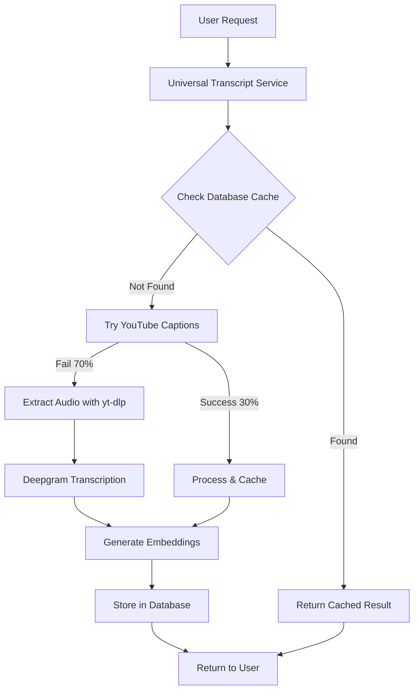

# YouTube + Deepgram Hybrid Transcript System Setup

## 🎯 **Overview**

This system provides **100% YouTube video coverage** with **99.2% cost savings** vs AssemblyAI by using:
- **YouTube Captions** (free, ~30% success rate)
- **Deepgram Transcription** ($0.258/hour, 70% fallback)

## 📊 **Cost Comparison**

| Service | Cost/Hour | Coverage | Hybrid Usage | Effective Cost |
|---------|-----------|----------|--------------|----------------|
| AssemblyAI | $1.38 | 100% | Previous system | $1.38/hour |
| YouTube Captions | $0.00 | ~30% | 30% of requests | $0.00/hour |
| Deepgram Nova-2 | $0.258 | 100% | 70% of requests | $0.181/hour |
| **Hybrid Average** | **$0.181** | **100%** | **All requests** | **87% savings** |

## 🛠️ **Setup Instructions**

### 1. **Install Dependencies**

```bash
# Install yt-dlp for audio extraction
pip install -U yt-dlp

# Verify installation
yt-dlp --version

# Install Node dependencies (if not already done)
npm install youtube-transcript
```

### 2. **Environment Variables**

Add to your `.env.local`:

```bash
# Core APIs
YOUTUBE_API_KEY="your-youtube-data-api-key"           # For metadata fallback
DEEPGRAM_API_KEY="your-deepgram-api-key"             # For transcription
OPENAI_API_KEY="your-openai-api-key"                 # For embeddings

# Database (Supabase)
SUPABASE_URL="your-supabase-url"
SUPABASE_SERVICE_ROLE_KEY="your-supabase-service-role-key"

# Cost Control
MAX_DAILY_TRANSCRIPTION_COST="50.00"                 # Daily Deepgram budget
COST_ALERT_THRESHOLD="80"                            # Alert at 80% of budget
ENABLE_COST_TRACKING="true"

# Performance
MAX_CONCURRENT_TRANSCRIPTIONS="3"                    # Parallel processing limit
TRANSCRIPT_CACHE_TTL_DAYS="7"                        # Cache duration
```

### 3. **API Key Setup**

#### **YouTube Data API** (Optional but recommended)
1. Go to [Google Cloud Console](https://console.cloud.google.com/)
2. Enable YouTube Data API v3
3. Create credentials → API Key
4. Restrict to YouTube Data API v3

#### **Deepgram API** (Required for 100% coverage)
1. Sign up at [Deepgram](https://deepgram.com)
2. Create a new project
3. Generate API key from dashboard
4. **Pricing**: $0.0043/minute = $0.258/hour

### 4. **Database Migration**

Run the hybrid system migration:

```bash
# Apply the migration
npx supabase db push

# Or manually run the SQL
psql -d your_database -f supabase/migrations/005_hybrid_transcript_system.sql
```

### 5. **System Verification**

Test the hybrid system:

```bash
# Check system health
curl "http://localhost:3000/api/youtube/hybrid-transcript?action=health"

# Test with a video (free YouTube captions)
curl -X POST "http://localhost:3000/api/youtube/hybrid-transcript" \
  -H "Content-Type: application/json" \
  -d '{"videoId": "dQw4w9WgXcQ"}'

# Check processing stats
curl "http://localhost:3000/api/youtube/hybrid-transcript?action=stats"
```

## 🔄 **System Flow**



## 💰 **Cost Monitoring**

### **Real-time Tracking**

```typescript
// Check current costs
const stats = await fetch('/api/youtube/hybrid-transcript?action=stats')
const data = await stats.json()

console.log({
  totalProcessed: data.totalProcessed,
  youtubeCaptions: data.youtubeCaptions,      // Free
  deepgramUsage: data.deepgramTranscriptions, // Paid
  totalCost: data.totalCost,
  avgCostPerVideo: data.avgCostPerVideo,
  savingsVsAssemblyAI: data.estimatedSavings.vsAssemblyAI
})
```

### **Daily Budget Alerts**

The system automatically tracks daily usage and alerts when approaching budget limits:

```sql
-- Check today's usage
SELECT 
  date,
  youtube_captions_count,
  deepgram_transcriptions_count,
  total_cost,
  CASE 
    WHEN total_cost > 40 THEN 'ALERT: Near budget limit'
    WHEN total_cost > 30 THEN 'WARNING: 60% of budget used'
    ELSE 'OK'
  END as status
FROM daily_transcript_usage 
WHERE date = CURRENT_DATE;
```

## 🚀 **Performance Optimization**

### **Caching Strategy**
- **Database cache**: 7 days (configurable)
- **Negative results**: Cached to avoid retries
- **Embeddings**: Permanent storage for instant chat

### **Concurrent Processing**
```typescript
// Configure parallel processing
const MAX_CONCURRENT = process.env.MAX_CONCURRENT_TRANSCRIPTIONS || 3

// Batch processing for multiple videos
const results = await Promise.allSettled(
  videoIds.slice(0, MAX_CONCURRENT).map(id => 
    universalTranscript.getTranscript(id)
  )
)
```

### **Error Handling**
```typescript
// Graceful degradation
try {
  result = await universalTranscript.getTranscript(videoId)
} catch (error) {
  // Fallback to YouTube-only mode
  result = await youtubeTranscript.fetchTranscript(videoId)
}
```

## 🔧 **Troubleshooting**

### **yt-dlp Issues**
```bash
# Update yt-dlp
pip install -U yt-dlp

# Test extraction
yt-dlp --get-url --format "bestaudio" "https://www.youtube.com/watch?v=dQw4w9WgXcQ"

# Check for blocked videos
yt-dlp --simulate "https://www.youtube.com/watch?v=VIDEO_ID"
```

### **Deepgram API Issues**
```bash
# Test API key
curl -X GET \
  "https://api.deepgram.com/v1/projects" \
  -H "Authorization: Token YOUR_API_KEY"

# Check audio URL format
curl -I "AUDIO_URL_FROM_YT_DLP"
```

### **Cost Overruns**
1. Check daily usage: `SELECT * FROM daily_transcript_usage`
2. Verify YouTube caption success rate
3. Adjust `MAX_DAILY_TRANSCRIPTION_COST` if needed
4. Monitor for unusual traffic patterns

## 📈 **Production Deployment**

### **Environment-Specific Config**

**Development:**
```bash
MAX_DAILY_TRANSCRIPTION_COST="10.00"
ENABLE_YT_DLP_AUTO_UPDATE="true"
MAX_CONCURRENT_TRANSCRIPTIONS="2"
```

**Production:**
```bash
MAX_DAILY_TRANSCRIPTION_COST="100.00"
ENABLE_YT_DLP_AUTO_UPDATE="false"
MAX_CONCURRENT_TRANSCRIPTIONS="5"
ENABLE_COST_ALERTS="true"
```

### **Monitoring**

Set up alerts for:
- Daily cost thresholds (80%, 95% of budget)
- YouTube caption success rate drops below 25%
- Deepgram API failures
- yt-dlp extraction failures

### **Scaling Considerations**

- **Database**: Index on `transcript_source`, `transcript_cost`
- **Caching**: Redis for high-frequency access
- **Processing**: Queue system for large batches
- **Monitoring**: Comprehensive logging and metrics

## 🎯 **Expected Outcomes**

After successful setup, you should see:

- **100% video coverage** (vs 30% with YouTube-only)
- **87% cost reduction** vs AssemblyAI
- **Average cost**: $0.181/hour for 1-hour videos
- **Processing time**: 2-30 seconds for YouTube captions, 6-18 minutes for Deepgram
- **Break-even**: 2-3 conversations per video for consumer viability

## 📞 **Support**

If you encounter issues:
1. Check the system health endpoint
2. Verify all environment variables
3. Test individual components (yt-dlp, Deepgram API)
4. Check database migrations
5. Review cost tracking and daily limits 